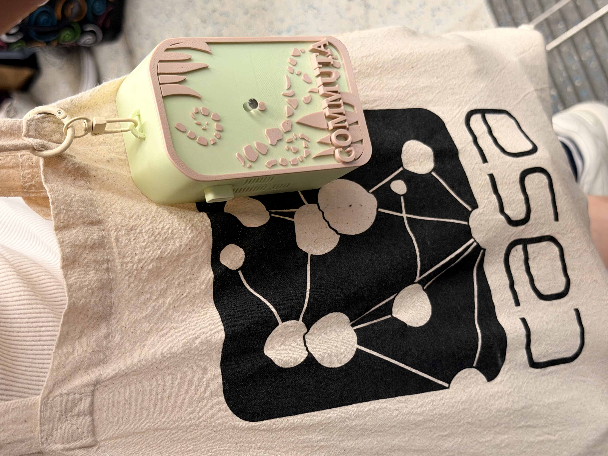

# Commuta — A Portable IoT Air Quality Monitor

**A wearable, battery-powered device that measures your personal air quality on the go — built to capture fine-particle (PM) exposure during everyday journeys on the London Underground.**

-02569B)

  

---

## Overview

Commuta is a compact, self-contained air quality monitor designed to be carried through a daily commute. Most air quality data comes from fixed street-level stations, which say little about what a person actually breathes underground, on a platform, or inside a carriage. Commuta closes that gap: it logs particulate matter and supporting environmental readings continuously as you travel, then streams the data to a companion iOS app over Bluetooth Low Energy.

The result is a personal, location-aware record of exposure — the kind of data that lets you see, for example, how a deep, older Underground line compares to a sealed, modern one.

## Key Features

- **Personal PM monitoring** — measures PM1, PM2.5, PM4 and PM10 with a laser particle sensor.
- **Full environmental context** — also logs CO₂, temperature, humidity, VOC and NOx indices, and barometric pressure.
- **Fully portable** — runs off an onboard rechargeable LiPo battery, no wires or phone tether needed to collect data.
- **On-device logging** — data is buffered to flash storage, so nothing is lost if the phone is out of range.
- **BLE companion app** — an iOS app receives live readings and lets you mark stations and journeys.
- **Discreet by design** — a custom 3D-printed enclosure and minimal indicator LEDs, intended to be worn unobtrusively.

## How It Works

Commuta is a three-part system: the **device** senses and logs, the **app** receives and tags, and the **analysis pipeline** turns raw logs into exposure insights.

  

## Hardware

The device is built around an ESP32 microcontroller with a stack of I²C sensors and a boosted power supply for the particle sensor.

| Component | Part | Role |
|---|---|---|
| Microcontroller | Adafruit HUZZAH32 (ESP32) | Sensing, logging, BLE |
| Particulate matter | Sensirion **SPS30** | PM1 / PM2.5 / PM4 / PM10 |
| CO₂ & climate | Sensirion **SCD40** | CO₂, temperature, humidity |
| Gas indices | Sensirion **SGP41** | VOC index, NOx index |
| Pressure | Infineon **DPS368** | Barometric pressure |
| Power | 2000 mAh LiPo + MT3608 boost | Portable supply (5 V for the SPS30) |

  

## Enclosure

A custom enclosure houses the electronics and battery in a wearable form factor. CAD and printable files live in [`/enclosure`](enclosure).

  

## Repository Structure

| Folder | Contents |
|---|---|
| [`Device/`](Device) | Main device firmware — sensor drivers, logging, and BLE communication (C++ / Arduino); PCB files. |
| [`commuta_app/`](commuta_app) | The Flutter iOS companion app. **See its own [README](commuta_app) for detailed app documentation.** |
| [`enclosure/`](enclosure) | 3D-printable enclosure files. |
| [`test_SPS30/`](test_SPS30) | Standalone bring-up sketch for the SPS30 particle sensor. |
| [`test_PMS5003/`](test_PMS5003) | Early sensor evaluation sketch (PMS5003). |
| [`Media/`](Media) | Photos, diagrams, and figures. |

## Getting Started

### Device firmware
1. Open the sketch in [`Device/`](Device) with the Arduino IDE.
2. Install the ESP32 board package and the required Sensirion sensor libraries.
3. Select the **Adafruit HUZZAH32 (ESP32)** board, connect over USB, and flash.

### Companion app
The iOS app is in [`commuta_app/`](commuta_app). Build and setup instructions are documented in that folder's README.

## Data & Analysis

Commuta was used to collect PM exposure data across multiple London Underground lines. The logged data is processed into cleaned datasets and figures comparing exposure across different platform and ventilation environments.

  

## About the Project

Commuta was developed as an MSc dissertation project on the **Connected Environments** programme at **UCL's Centre for Advanced Spatial Analysis (CASA)**.

🔗 **Project site:** https://annie-zhu1210.github.io/commuta

## Acknowledgements

- Sensor integration benefited from technical guidance from Sensirion support.

---

<i>Built by Annie Zhu · UCL CASA</i>

