# Commuta App

**The companion app for the Commuta portable air quality monitor — live readings, maps, history, and health guidance, built with Flutter.**


The Commuta app pairs with the Commuta device over Bluetooth Low Energy and turns its raw sensor stream into something you can act on: an at-a-glance air quality score, per-pollutant bands and health advice, a map of where you breathed what, and a browsable history of every journey.

<p align="center">
  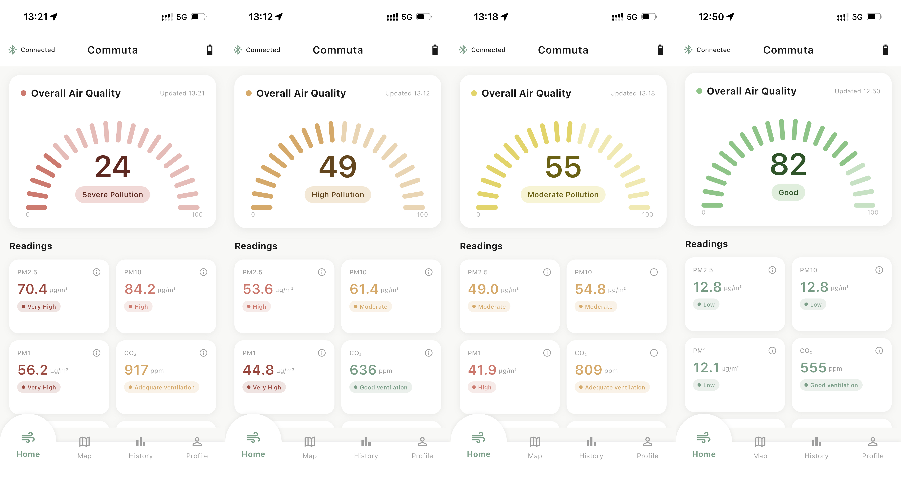
</p>

---

## Features

### Live monitoring (Home)

- **Hero Score** — a single 0–100 score (higher is cleaner) summarising the current reading, with a colour-coded arc gauge and a plain-English descriptor (*Good*, *Moderate Pollution*, *High Pollution*, *Severe Pollution*). The score follows the worst-metric-drives-the-score principle used by the UK DAQI and US EPA AQI. The full algorithm is documented in [`docs/hero_score_algorithm.md`](docs/hero_score_algorithm.md).
- **Live metric cards** for every sensor channel: PM1, PM2.5, PM4, PM10, CO₂, temperature, humidity, barometric pressure, VOC index, and NOx index.
- **Band scales** — each pollutant card shows where the current value sits on its own band scale (*Low / Moderate / High / Very High*), aligned with UK DAQI band boundaries.
- **Health recommendations** — tapping the ⓘ on a metric card opens an info sheet explaining what the metric is and what to do at the current level, updating live as new readings arrive.
- **Local context cards** — the nearest **UK DAQI** value from the London Air Quality Network (LAQN) and current **local weather** from OpenWeather, so device readings can be compared against the official outdoor picture.

<p align="center">
  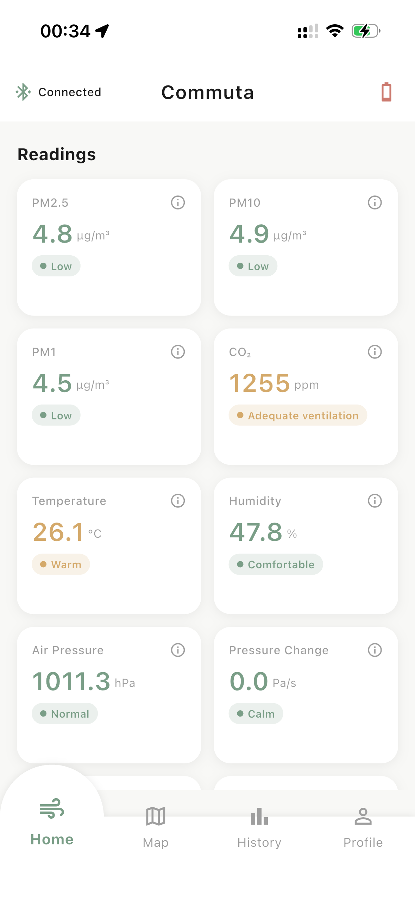
  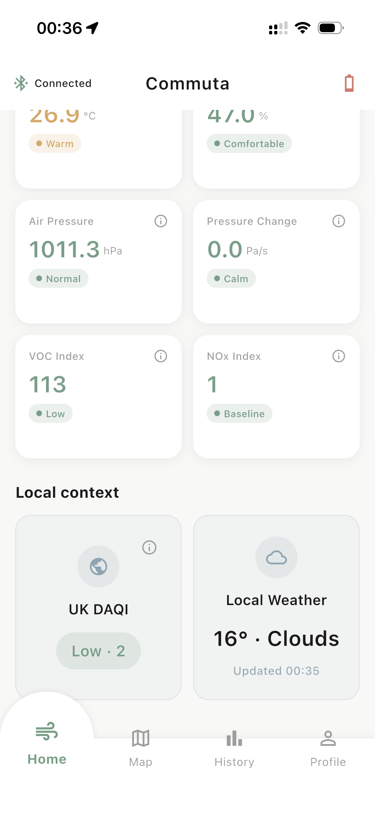
   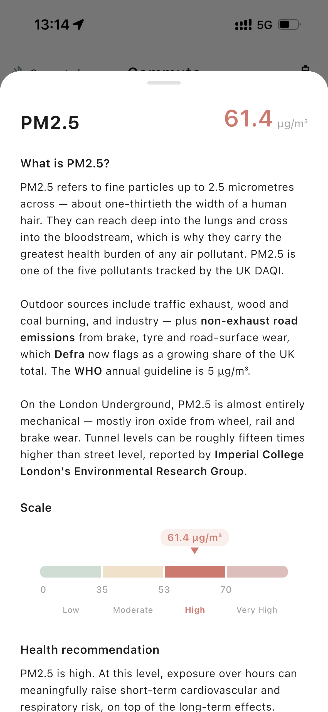
  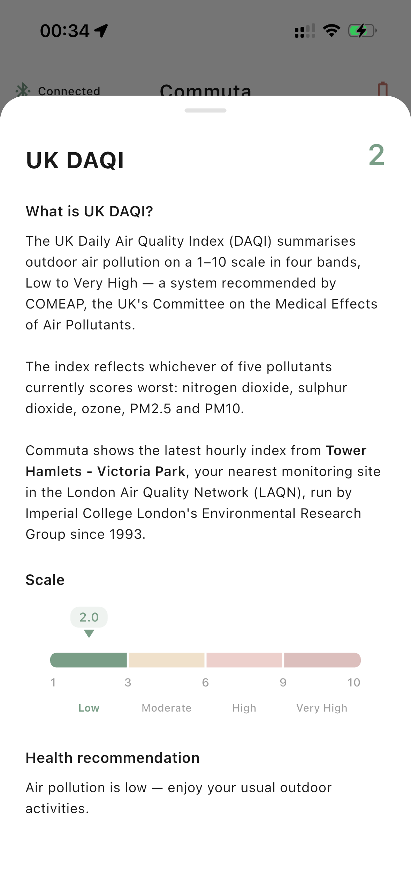
</p>

### Maps

- **Google Map view** — plots your path as you move, dropping colour-coded markers along the route; tapping a marker shows the detailed air quality reading captured at that point.
- **TfL Underground map view** — a custom-painted Tube map showing stations where air quality data has been collected, with per-station readings. Station dwell detection and classification happen automatically in the background.
- A floating toggle switches between the two views; both stay mounted so camera position, markers, and selections survive switching tabs.

<p align="center">
  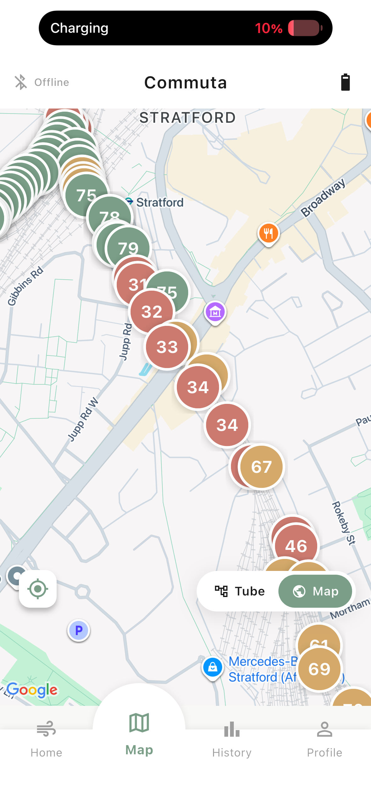
  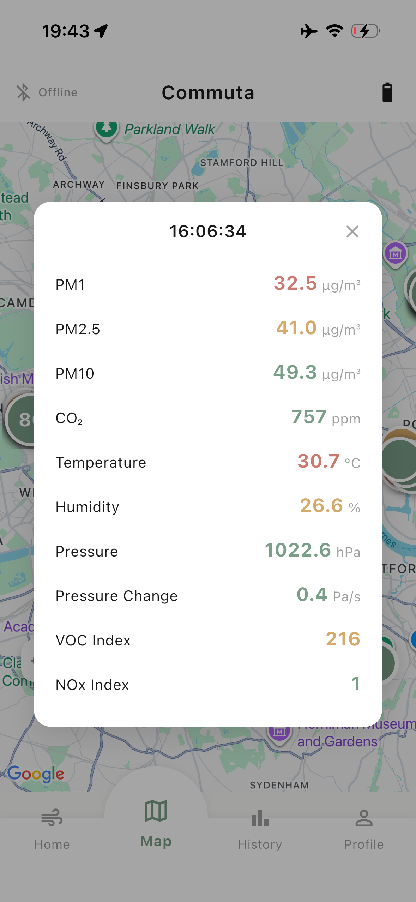
   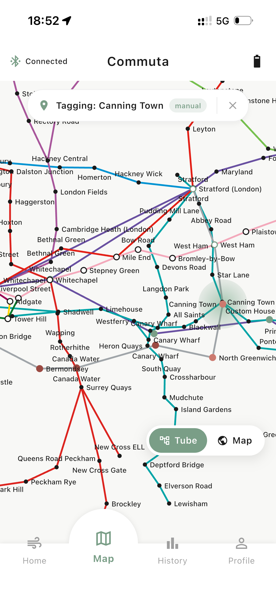
  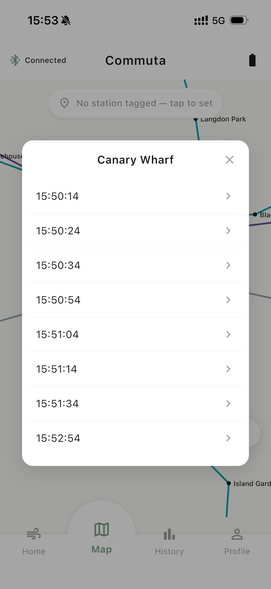
</p>

### History

- **Daily view** — line charts (fl_chart) of any day's readings, per metric.
- **Weekly view** — aggregated week-at-a-glance charts, navigable by week.
- All readings are persisted on-device in a local SQLite database (drift), so history survives app restarts and works fully offline.

<p align="center">
  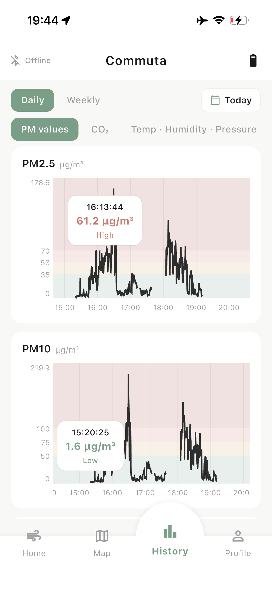
  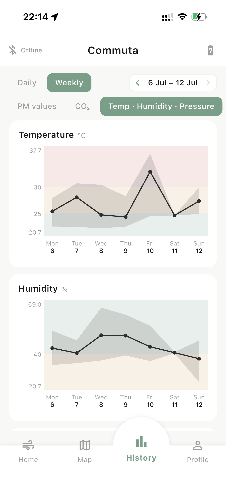
</p>

### Device pairing & sync

- **Scan & pair screen** — discovers nearby Commuta devices over BLE and manages the connection lifecycle (scanning → connecting → connected → syncing).
- **Buffered sync** — the device logs to its own flash storage while out of range; on reconnect, the app pulls the buffered backlog so no data is lost.
- Clear adapter-state handling: the UI distinguishes "Bluetooth is off" and "permission needed" from ordinary scan states.

<p align="center">
  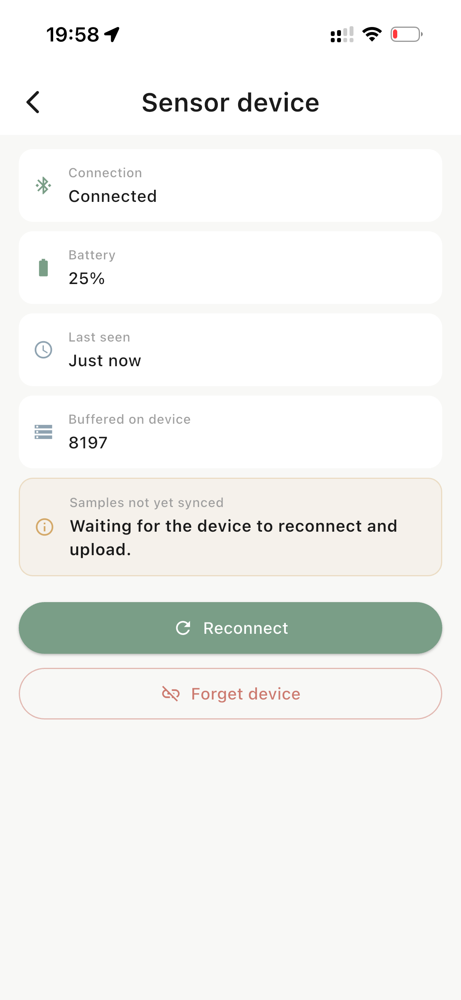
</p>

### Data export & profile

- **CSV export** — export *all readings*, *today's readings*, or the *battery characterisation log* as CSV via the iOS share sheet.
- **Device section** — connection status and device management.
- **Coming soon** (stubbed in the UI): **Account** (sign-in and cloud sync, Firebase-ready) and **Alerts** (custom threshold-based phone notifications).

<p align="center">
  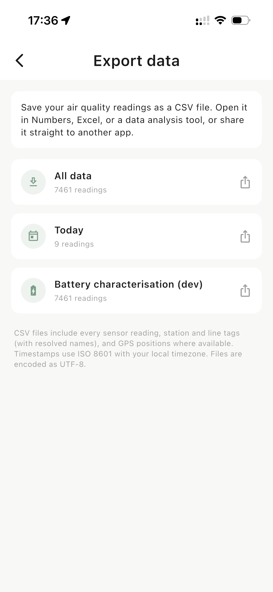
  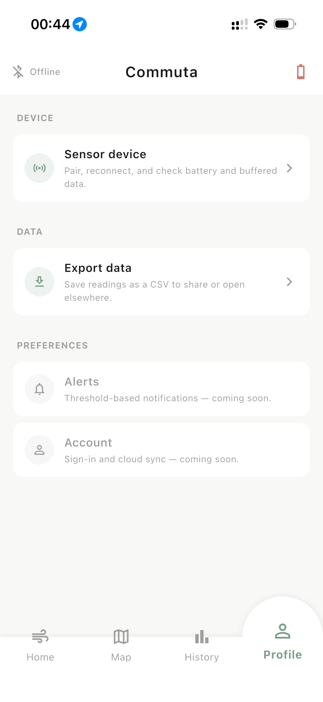
</p>

## Architecture

```
lib/
├── main.dart / app.dart      app entry, theming, bottom navigation
├── core/
│   ├── constants/            API keys & BLE UUIDs (gitignored; examples committed)
│   └── utils/                DAQI band logic, battery state-of-charge
├── data/                     models, drift database, datasources
├── screens/
│   ├── home/                 hero card, metric grid, DAQI & weather cards
│   ├── map/                  Google Map view, TfL map view, station picker
│   ├── history/              daily & weekly chart views
│   ├── scan_pair/            BLE discovery and pairing
│   └── profile/              device section, data export, preferences
├── services/                 the app's working core — BLE connection,
│                             readings repository, hero score, dwell
│                             detection, station classification, TfL map
│                             data, location, CSV export, local context
│                             (LAQN + OpenWeather)
└── widgets/                  hero AQI card, metric cards, band scales,
                              info sheets, nav bar, status banners
```

Key design points: the BLE layer is wrapped behind a library-agnostic `DeviceConnection` interface (so the app can run against a mock device without hardware), readings flow through a single `ReadingsRepository` backed by drift/SQLite, and all screens stay mounted in an `IndexedStack` so state survives tab switches.

## Getting started

### Prerequisites

- Flutter SDK ^3.10 (Dart 3)
- Xcode (the prototype targets iOS; other platform folders exist but are untested)
- A Commuta device (optional — the app includes a mock connection for UI development)

### Setup

Four config files are gitignored and must be created from their committed examples:

1. **API keys (.env)** — copy `.env.example` to `.env` and fill in:
   - `TFL_API_KEY` from https://api-portal.tfl.gov.uk/
   - `OPENWEATHER_API_KEY` from https://openweathermap.org/api
2. **OpenWeather key (Dart)** — copy `lib/core/constants/api_keys.example.dart` to `api_keys.dart` in the same folder and add your OpenWeather key. (LAQN needs no key.)
3. **BLE UUIDs** — copy `lib/core/constants/ble_uuids.example.dart` to `ble_uuids.dart` and fill in the same UUIDs used in the device firmware's `secrets.h` (see [`../Device/Commuta_code/secrets_example.h`](../Device/Commuta_code/secrets_example.h)). A mismatched service UUID makes scans silently find nothing.
4. **Google Maps keys** — copy `ios/Flutter/Secrets.xcconfig.example` to `Secrets.xcconfig` (and, for Android, `android/secrets.properties.example` to `secrets.properties`) and add your Google Maps API key(s).

Then:

```bash
flutter pub get
flutter run          # with an iOS device/simulator connected
```

### Refreshing TfL data

Station and line geometry for the Tube map lives in `assets/tfl/`. To refresh it from the TfL API:

```bash
dart run scripts/refresh_tfl_data.dart
```

## Related documentation

- [Hero Score algorithm](docs/hero_score_algorithm.md) — how the 0–100 score and descriptors are computed
- [Device firmware](../Device) — the ESP32 firmware this app talks to
- [Repository overview](../README.md) — the full Commuta system
